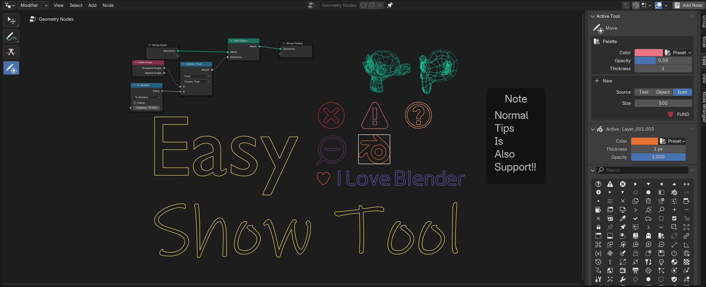

## Intro

**Easy Show Tool** is a blender addon that allow you to add complex and amazing note in node editor. It is quick, fast
and easy to use.

The notes you created will be **stored in the blend file**, so it is easy for others who has not installed
this addon to see it, which helps them to understand how your wonderful nodes work.

## Download

[Releases](https://github.com/atticus-lv/EasyShowTool/releases)

## How To Use

[Online Documentation](https://atticus-lv.github.io/EasyShowTool/)

You can also launch the documentation in addon preferences on your local machine.

