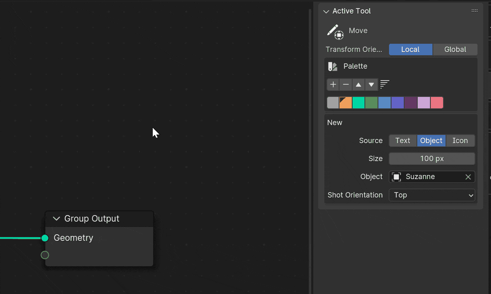
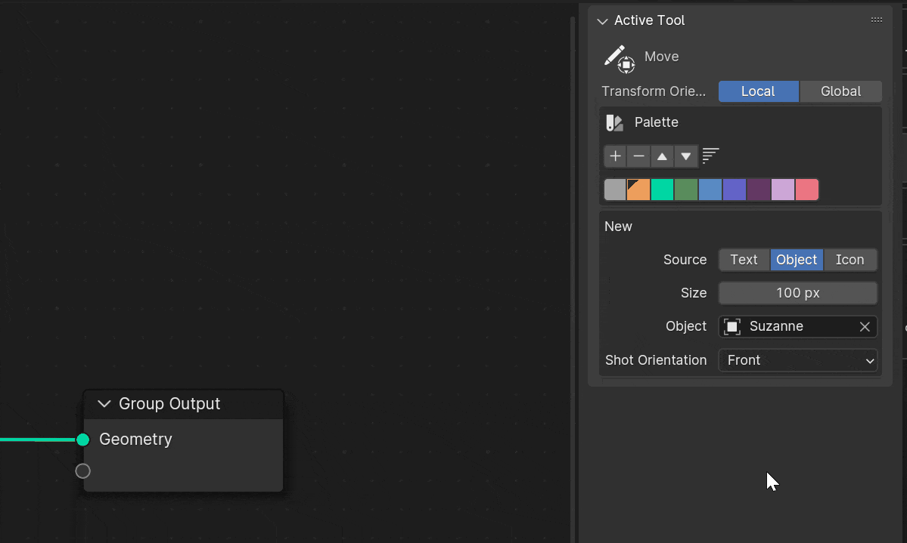
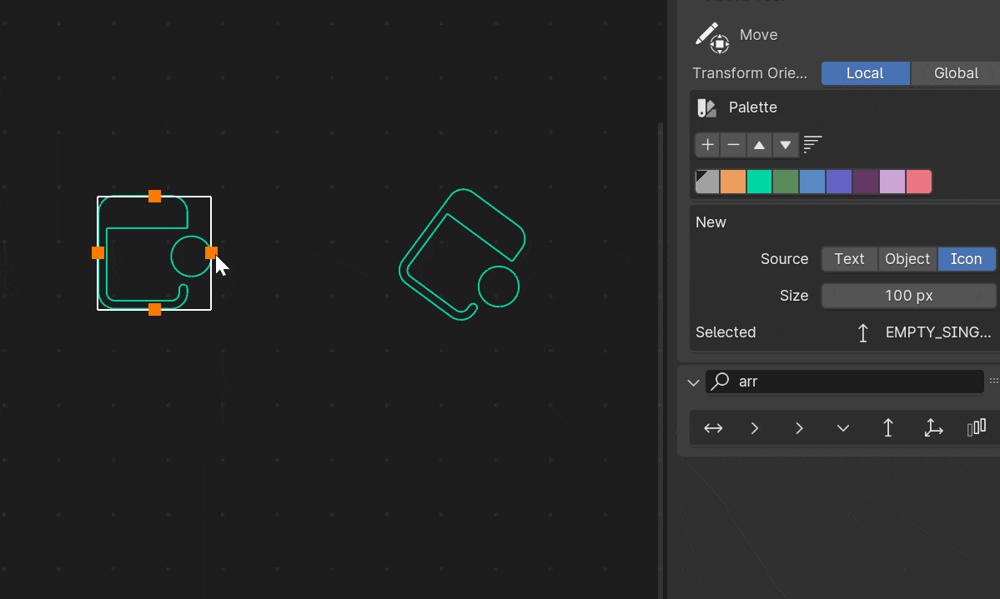
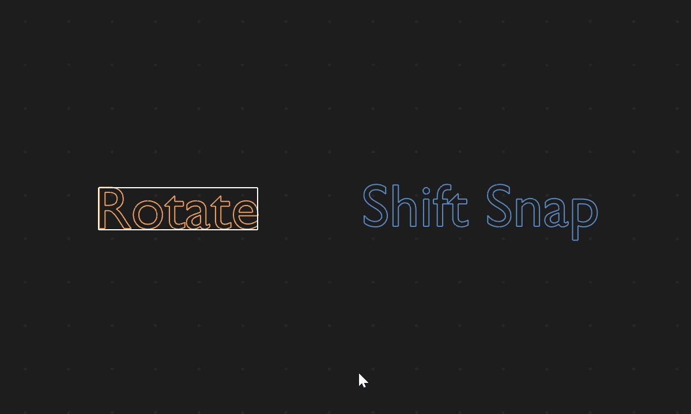
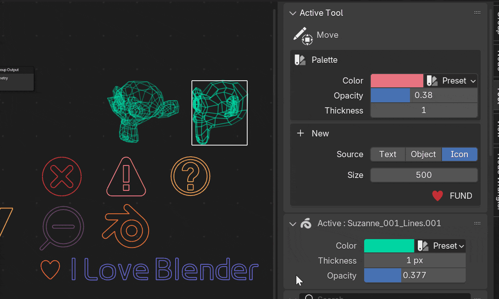

# Intro

> **Easy Show Tool** is a blender addon that allow you to add complex and amazing note in node editor. It is quick, fast
> and easy to use.
>
> The notes you created will be **stored in the blend file**, so it is easy for others who has not installed
> this addon to see it, which helps them to understand how your wonderful nodes work.

---

# Feature

## Text Frame Annotation

> easy add and edit text annotation (from text editor)

1. Click The add button to add a new text frame
2. Double click the text frame to edit the text
3. Edit the text in the text editor

## Complex Annotation

> _You need to switch to the tool first_

[Check Keymap for more details](keymap.md)

#### Select Layers!

In **v2.0** you can select multi-layers. **Just press G/S/R to move/scale and rotate them**

Also, you can align and distribute them

> Right click for the context menu

#### Create from multiple types

> Double click to add a new complex annotation, make sure you have selected the type you want to add

**text**
+ custom font
+ custom color

**object**
+ mesh & gpencil
+ shot angle

**blender icon**
+ search icon

#### Transform Tool

> Transform Orientations: local will consider the object's rotation, global will not

**move**
+ screen pan support

**rotate**
+ move the mouse out of the corner
+ shift to snap angle (before drag or when dragging)

**scale**
+ F to flip
+ color

#### Color

+ select color palette
+ or you can press C to drop color on the hover layer instead of select them

    
