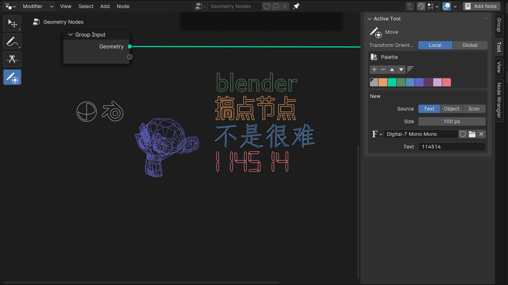
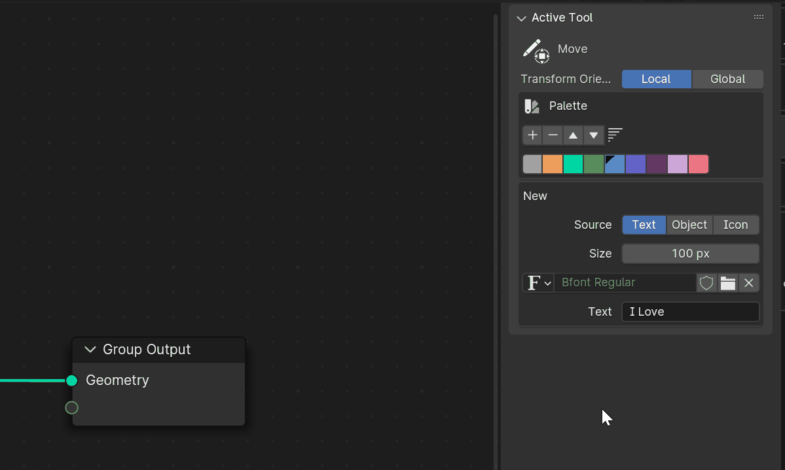
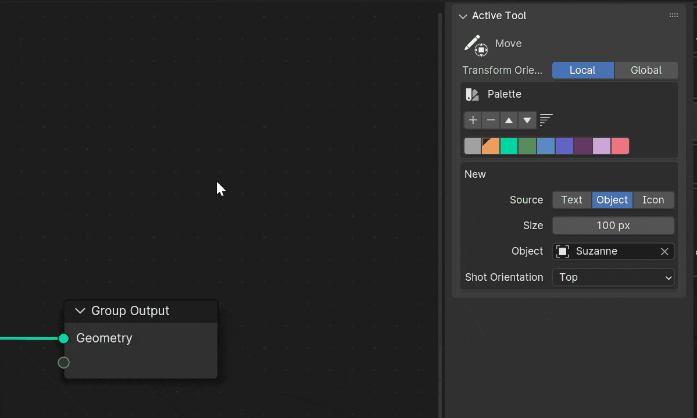
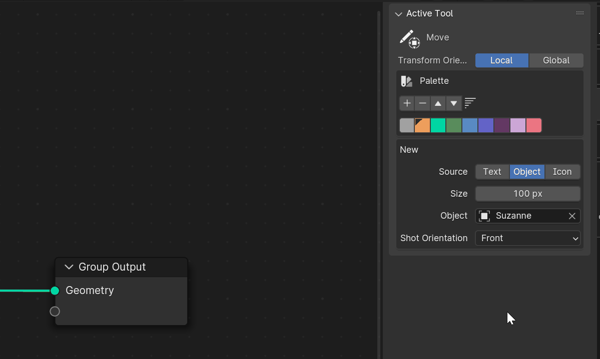
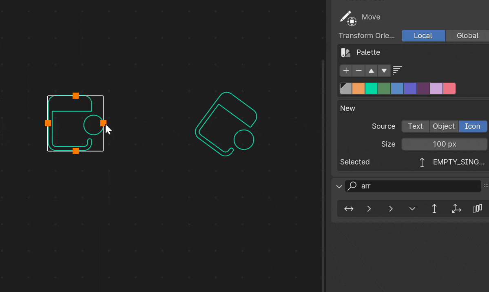
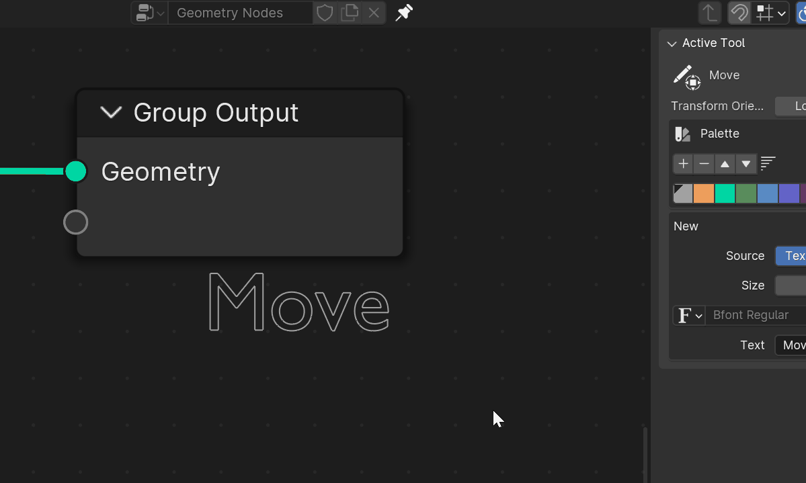
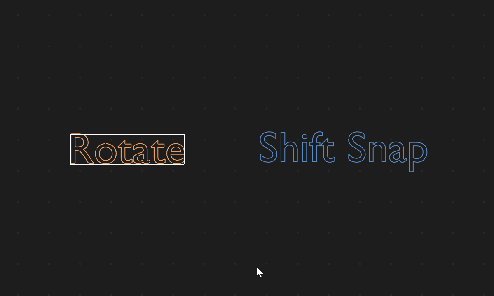
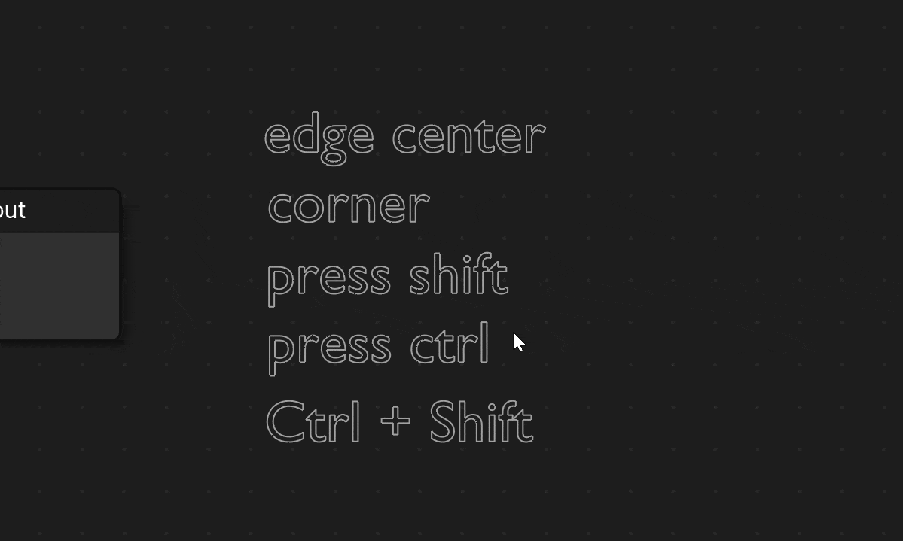
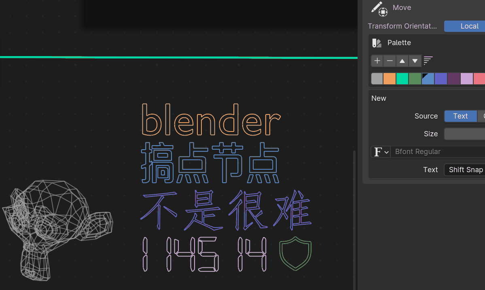

# 简介

> **Easy Show Tool** 是一个 Blender 插件，允许你在节点编辑器中添加复杂且炫酷的注释。又快又好用。
>
> 你创建的注释将被**存储在 blend 文件中**，所以哪些没用这个插件的其他人也可以看到这些注释，这有助于他们理解你炫酷的节点如何工作。

---

# 特性

## 文本框注释

> 轻松添加和编辑文本注释（来自文本编辑器）

1. 点击添加按钮以添加新的文本框
2. 双击文本框以编辑文本
3. 在文本编辑器中编辑文本

## 复杂注释

> _你需要先切换到工具_

[查看更多详细的快捷键](zh-cn/keymap.md)

#### 从多种类型创建

> 双击以添加新的复杂注释，确保你已经选择了你想要添加的类型

**文本**
+ 自定义字体
+ 自定义颜色

**对象**
+ 网格 & gpencil
+ 拍摄角度

**blender 图标**
+ 搜索图标

#### 变换工具

> 变换方向：本地模式会考虑对象的旋转，全局模式则不会

**移动**
+ 支持屏幕平移

**旋转**
+ 将鼠标移出角落
+ 按住 shift 键以吸附角度（拖动前或拖动时）

**缩放**
+ 按 F 键以翻转
+ 颜色

#### 颜色

+ 按 C 键以着色

